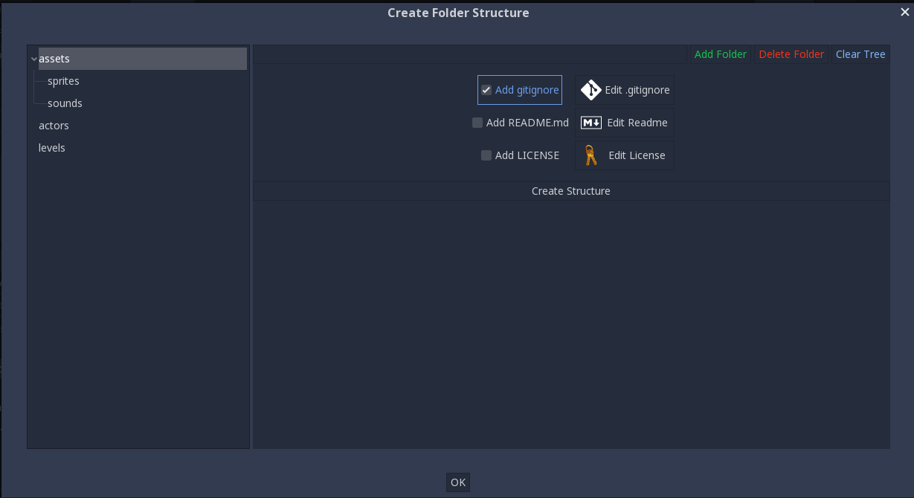

# Godot Project Folder Structure

Godot plugin which adds ability to simplify the process of
creating the folder structure for godot projects.

## Compatibility

Godot 3.0+ compatible.

## How to use

Located in `Project` > `Tools` and click `Create Folder Structure` menu option

A window will popup with a folder tree node and where you can add, delete, clear
folders, also you could add gitignore, readme and license files
